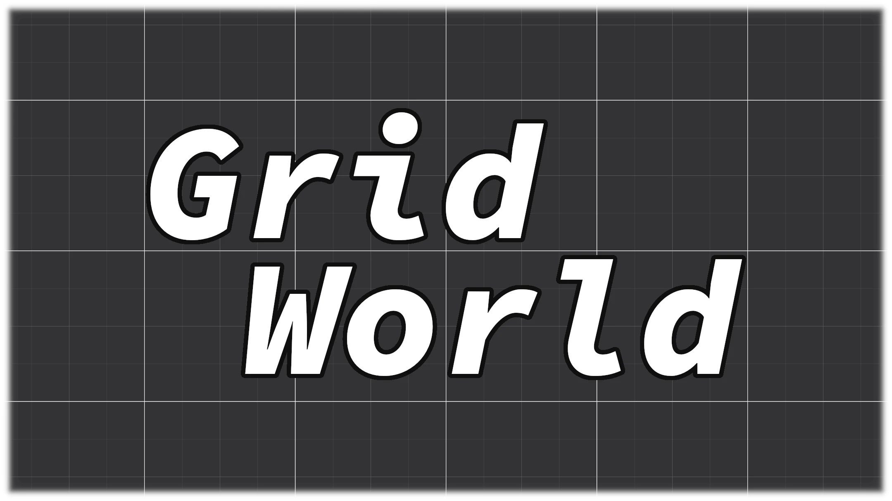

# overte-worlds
This is a collection of worlds I have made in Overte that are freely accessible. The intended use case for these worlds are to be serverless worlds. They can however be used in servers too, they would just need to be imported.
To visit any of these worlds, just copy the provided url into the Places app search bar.

## GridWorld

A simple flat grid world. 

No distractions.

Visit: https://armored-dragon.github.io/overte-worlds/GridWorld/GridWorld.json